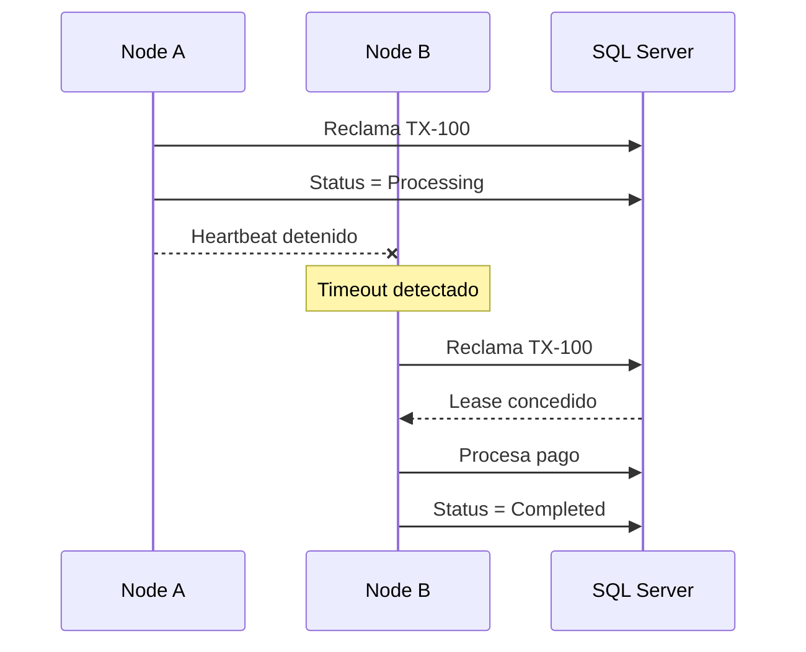

# SolidarityGrid

[](https://dotnet.microsoft.com/download/dotnet/8.0)
[](https://www.docker.com/)
[](https://www.microsoft.com/sql-server)
[]()

---

Plataforma distribuida para procesamiento de pagos sin coordinador central ni sistema de mensajería externo.

Desarrollada en .NET 8 como prueba de concepto para el desafío **Payment Mesh Resilience**: múltiples nodos colaboran procesando transacciones de forma resiliente, detectan caídas de compañeros y recuperan trabajo pendiente automáticamente, garantizando procesamiento único por pago.

---

# Tabla de Contenidos

- [Objetivos](#objetivos)
- [Características principales](#características-principales)
- [Arquitectura](#arquitectura)
- [Flujo de Procesamiento](#flujo-de-procesamiento)
- [Recuperación ante Fallos](#recuperación-ante-fallos)
- [Estructura del proyecto](#estructura-del-proyecto)
- [Tecnologías](#tecnologías)
- [Configuración](#configuración)
- [Ejecución](#ejecución)
- [API](#api)
- [Simulación de Failover](#simulación-de-failover)
- [Observabilidad](#observabilidad)
- [Autor](#autor)
- [Local Pipeline](#local-pipeline)

---

# Objetivos

La solución fue diseñada para demostrar los siguientes aspectos técnicos:

- Procesamiento distribuido de transacciones.
- Coordinación entre múltiples nodos sin un líder permanente.
- Recuperación automática de transacciones cuando un nodo deja de responder.
- Prevención del procesamiento duplicado mediante concurrencia optimista.
- Comunicación directa entre nodos utilizando HTTP.
- Despliegue completo con un único comando mediante Docker Compose.
- Arquitectura mantenible, desacoplada y preparada para evolucionar.

---

# Características principales

- Arquitectura basada en Clean Architecture.
- Procesamiento asíncrono mediante Background Services.
- Comunicación Peer-to-Peer utilizando Heartbeats HTTP.
- Detección automática de nodos inactivos.
- Recuperación de transacciones huérfanas (Failover).
- Optimistic Concurrency utilizando `RowVersion`.
- Asignación exclusiva de transacciones mediante Lease Ownership.
- Persistencia centralizada en SQL Server.
- Documentación automática mediante Swagger.
- Despliegue reproducible utilizando Docker Compose.

---

# Arquitectura

La plataforma está compuesta por tres nodos idénticos que ejecutan exactamente la misma aplicación.

No existe un nodo maestro ni un coordinador central. Cada instancia puede aceptar solicitudes, reclamar transacciones pendientes, procesar pagos y asumir el trabajo de otro nodo cuando detecta un fallo.

Todos los nodos comparten la misma base de datos y mantienen comunicación periódica mediante Heartbeats para conocer el estado del clúster.


## Clean Architecture

La solución está organizada siguiendo los principios de Clean Architecture, separando claramente las responsabilidades entre las diferentes capas de la aplicación.

Esta organización permite que las reglas de negocio permanezcan independientes de la infraestructura, facilitando la mantenibilidad, la evolución del sistema y las pruebas unitarias.

```
Presentation (API)
        │
        ▼
Application
        │
        ▼
Domain
        ▲
        │
Infrastructure
```
Cada proyecto posee una responsabilidad específica:

| Proyecto | Responsabilidad |
|----------|-----------------|
| SolidarityGrid.Api | Expone los endpoints REST, configuración, inyección de dependencias y documentación Swagger. |
| SolidarityGrid.Application | Contiene los casos de uso, servicios de aplicación y contratos utilizados por la solución. |
| SolidarityGrid.Domain | Define el modelo de dominio, entidades, enumeraciones, excepciones y reglas de negocio. |
| SolidarityGrid.Infrastructure | Implementa persistencia, Entity Framework Core, repositorios, Background Services y comunicación entre nodos. |


## Responsabilidades de cada nodo

Cada instancia de la aplicación es capaz de:

- Exponer la API REST.
- Registrar nuevas transacciones.
- Reclamar pagos pendientes.
- Procesar transacciones de forma asíncrona.
- Publicar Heartbeats periódicos.
- Detectar nodos inactivos.
- Recuperar transacciones abandonadas.
- Finalizar el procesamiento de forma segura.

Esta estrategia elimina el punto único de fallo y permite escalar horizontalmente agregando nuevas instancias sin modificar la lógica de negocio.

---
# Desiciones clave

| Decisión | Justificación |
|----------|-----------------|
| Clean Architecture	| Separa reglas de negocio de infraestructura, facilitando mantenibilidad y pruebas. |
| SQL Server compartido	| Centraliza el estado y simplifica la coordinación distribuida.|
| BackgroundService	| Desacopla recepción HTTP del procesamiento, evitando bloqueos.|
| Heartbeats HTTP | Detectan nodos inactivos sin herramientas externas.|
| Optimistic Concurrency (RowVersion)	| Evita duplicados usando control de concurrencia nativo de SQL Server.|
| Docker Compose	| Levanta toda la plataforma con un comando.|
| HTTP entre nodos | complejidad y evita brokers externos.|
---

## Procesamiento asíncrono

El procesamiento de un pago no ocurre durante la solicitud HTTP.

Cuando un cliente registra una transacción, la API únicamente valida la información y persiste el registro con estado Pending, devolviendo inmediatamente una respuesta al consumidor.

El trabajo pesado es ejecutado posteriormente por un BackgroundService, permitiendo que la API permanezca ligera y con baja latencia.

### Beneficios

- Respuestas rápidas para el cliente.
- Menor tiempo de bloqueo de conexiones HTTP.
- Mayor capacidad para atender múltiples solicitudes concurrentes.
- Separación entre aceptación de solicitudes y procesamiento.

---

## Comunicación entre nodos

Los nodos forman una red Peer-to-Peer (P2P).

No existe un coordinador central responsable de distribuir el trabajo.

Cada instancia conoce la dirección de los demás nodos mediante configuración y mantiene comunicación periódica utilizando solicitudes HTTP.

```text
Node A  ←────→  Node B
   ▲               ▲
   │               │
   └──────→────────┘
         Node C
```

Esta estrategia elimina el punto único de fallo y permite incorporar nuevas instancias sin modificar la lógica de coordinación.

---

## Heartbeat

Cada nodo publica periódicamente un Heartbeat, indicando que continúa activo mientras procesa transacciones.

El Heartbeat representa un mecanismo liviano de supervisión entre nodos y constituye la base para detectar fallos dentro del clúster.

Si un nodo deja de actualizar su Heartbeat durante un tiempo superior al configurado, el resto del clúster lo considera inactivo.

```Node A

Heartbeat
Heartbeat
Heartbeat
Heartbeat
...
X

Timeout

↓

Node B detecta la ausencia de Heartbeats

↓

Node B inicia el proceso de recuperación
```

### Objetivos

- Detectar nodos caídos.
- Identificar transacciones abandonadas.
- Iniciar automáticamente el proceso de recuperación.
- Evitar intervención manual.

---

## Lease Ownership

Para evitar que varios nodos procesen simultáneamente la misma transacción, cada pago posee un propietario temporal (Lease Owner).

Cuando un nodo reclama una transacción pendiente, registra su identidad como propietario del procesamiento.

Mientras dicho Lease permanezca vigente, ningún otro nodo podrá continuar ese trabajo.

```
TX-100

Owner = node-b

Status = Processing
```
Si el propietario deja de responder y su Heartbeat expira, otro nodo puede reclamar nuevamente esa transacción y convertirse en el nuevo propietario.

Esta estrategia evita condiciones de carrera sin necesidad de utilizar mecanismos de bloqueo distribuidos externos.

---

## Optimistic Concurrency

La consistencia de los datos se garantiza mediante Optimistic Concurrency utilizando una columna `RowVersion` administrada por SQL Server.

Cada actualización verifica que ningún otro proceso haya modificado previamente el mismo registro.

Si dos nodos intentan actualizar simultáneamente una transacción, únicamente uno podrá completar la operación; el segundo recibirá una excepción de concurrencia y descartará el procesamiento.

### Beneficios

- Evita bloqueos prolongados en la base de datos.
- Reduce la contención entre procesos concurrentes.
- Garantiza consistencia incluso bajo alta concurrencia.
- Aprovecha las capacidades nativas de SQL Server.

---

## Idempotencia

Uno de los requisitos principales del desafío consiste en garantizar que un pago nunca sea procesado más de una vez.

La solución implementa idempotencia mediante la combinación de:

- Estado de la transacción.
- Lease Ownership.
- Optimistic Concurrency.
- Validaciones antes de iniciar el procesamiento.

Una transacción marcada como Completed nunca volverá a ser reclamada, incluso si otro nodo intenta procesarla posteriormente.

---

# Recuperación ante Fallos

La recuperación automática constituye el núcleo de la solución.

Cuando un nodo deja de responder durante el procesamiento de un pago, el resto del clúster continúa supervisando su estado mediante Heartbeats.

Si el tiempo de espera configurado expira, cualquier nodo disponible puede reclamar las transacciones que quedaron en estado Processing, reasignando el trabajo y completándolo sin intervención humana.



La solución no implementa algoritmos formales de consenso como Raft o Paxos. En su lugar, utiliza una coordinación liviana basada en base de datos compartida, Heartbeats periódicos, Lease Ownership y Optimistic Concurrency. Suficiente para el alcance de la prueba, manteniendo simplicidad y evitando servicios externos.

___

# Estructura del proyecto

```
SolidarityGrid
│
├── .github
├── .vs
├── docker
├── docs
├── src
│   ├── SolidarityGrid.Api
│   │   ├── Contracts
│   │   │   ├── Request
│   │   │   └── Responses
│   │   ├── Controllers
│   │   ├── Properties
│   │   ├── appsettings.json
│   │   ├── DependencyInjection.cs
│   │   ├── Dockerfile
│   │   ├── GlobalUsingApi.cs
│   │   ├── Program.cs
│   │   └── SolidarityGrid.Api.http
│   │
│   ├── SolidarityGrid.Application
│   │   ├── Abstractions
│   │   ├── DTOs
│   │   ├── Mappings
│   │   ├── Services
│   │   ├── DependencyInjection.cs
│   │   └── GlobalUsingApplication.cs
│   │
│   └──SolidarityGrid.Infrastructure
│   │   ├── Configuration
│   │   ├── HostedServices
│   │   ├── Mesh
│   │   ├── Migrations
│   │   ├── Persistence
│   │   ├── Repositories
│   │   ├── DependencyInjection.cs
│   │   └── GlobalUsingsInfrastructure.cs 
│
├── tests
├── .gitignore
├── docker-compose.yml
└── README.md

```
___
## Sección: Tecnologías

```markdown
# Tecnologías

La solución fue desarrollada utilizando tecnologías del ecosistema .NET, priorizando simplicidad, mantenibilidad y facilidad de despliegue.

| Tecnología | Versión | Propósito |
|------------|---------|-----------|
| .NET | 8 | Plataforma principal |
| ASP.NET Core | 8 | API REST |
| Entity Framework Core | 8 | Persistencia |
| SQL Server | 2022 | Base de datos compartida |
| Docker | 27+ | Contenedorización |
| Docker Compose | v2 | Orquestación local |
| Swagger / OpenAPI | 3.0 | Documentación de la API |

---

# Configuración

Cada instancia de la aplicación posee una configuración independiente que define su identidad dentro del clúster y los parámetros utilizados para coordinar el procesamiento distribuido.

## Configuración del nodo

```json
{
  "Node": {
    "NodeName": "node-a",
    "HeartbeatTimeoutSeconds": 10,
    "ProcessingIntervalSeconds": 5,
    "PeerNodes": [
      "http://node-b:8080",
      "http://node-c:8080"
    ]
  }
}
```

## Parámetros

| Propiedad | Descripción |
|------------|-------------|
| NodeName | Identificador único del nodo dentro del clúster. |
| HeartbeatTimeoutSeconds | Tiempo máximo permitido sin recibir Heartbeats antes de considerar un nodo inactivo. |
| ProcessingIntervalSeconds | Intervalo utilizado por el Background Service para buscar nuevas transacciones pendientes. |
| PeerNodes | Lista de nodos con los que se mantiene comunicación para verificar el estado del clúster. |

---

## Sección: Ejecución

```markdown
# Ejecución

## Requisitos

Antes de ejecutar la solución es necesario contar con:

- .NET SDK 8
- Docker Desktop
- Docker Compose

## Clonar el repositorio

```bash
git clone https://github.com/DavidV-2/SolidarityGrid.git

cd SolidarityGrid
```

## Levantar toda la plataforma

La solución completa se inicia mediante un único comando.

```bash
docker compose up --build
```

Este comando crea automáticamente:

- Base de datos SQL Server.
- Red interna de Docker.
- Nodo A.
- Nodo B.
- Nodo C.

No se requiere ninguna configuración manual adicional.

---

## Contenedores

Una vez iniciado el entorno deberán encontrarse los siguientes servicios:

| Contenedor | Función |
|------------|----------|
| solidaritygrid-node-a | Nodo de procesamiento |
| solidaritygrid-node-b | Nodo de procesamiento |
| solidaritygrid-node-c | Nodo de procesamiento |
| solidaritygrid-sql | SQL Server |

Puede verificarse utilizando:

```bash
docker ps
```

# Acceso a Swagger

Cada nodo expone su propia documentación OpenAPI.

| Nodo | URL |
|-------|-----|
| Node A | http://localhost:8081/swagger |
| Node B | http://localhost:8082/swagger |
| Node C | http://localhost:8083/swagger |

Aunque cualquiera de los tres puede recibir solicitudes, durante las pruebas es suficiente utilizar uno de ellos.

---

# API

## Crear un pago

Registra una nueva solicitud de procesamiento.

### Endpoint

```http
POST /api/payments
```

### Request

```json
{
  "transactionId": "TX001",
  "amount": 150.00,
  "currency": "USD"
}
```

### Respuesta

```http
202 Accepted
```

La API responde inmediatamente después de registrar la transacción.

El procesamiento continúa de forma asíncrona mediante un `BackgroundService`.

---

## Consultar pagos

Obtiene el listado de transacciones registradas y su estado actual.

### Endpoint

```http
GET /api/payments
```

### Información disponible

- Identificador de la transacción.
- Estado.
- Nodo responsable.
- Fecha de creación.
- Fecha de inicio del procesamiento.
- Fecha de finalización.

### Ejemplo

| Transaction | Status | Owner |
|--------------|------------|-----------|
| TX001 | Completed | node-a |
| TX002 | Processing | node-c |
| TX003 | Pending | - |

---

## Estado del clúster

Permite conocer qué nodos se encuentran disponibles.

### Endpoint

```http
GET /api/nodes/status
```

### Respuesta

```json
{
  "aliveNodes": [
    "node-a",
    "node-b",
    "node-c"
  ],
  "deadNodes": [],
  "totalNodes": 3
}
```

Este endpoint facilita verificar el comportamiento del mecanismo de Heartbeats durante las pruebas de resiliencia.
---

## 5. Recuperación automática

Uno de los nodos disponibles reclamará las transacciones que quedaron pendientes y continuará el procesamiento hasta completarlas.

No se requiere intervención manual.

---

## Resultado esperado

Después de consultar nuevamente:

```http
GET /api/payments
```

Las transacciones originalmente asignadas al nodo detenido deberán aparecer con estado:

```text
Completed
```

y con un nuevo nodo responsable.

Este comportamiento demuestra la capacidad de recuperación automática del clúster frente a fallos inesperados.

---

# Observabilidad

Uno de los criterios de evaluación de la prueba consiste en que los registros permitan comprender claramente el comportamiento del sistema distribuido.

Por este motivo, cada nodo registra los eventos más relevantes del ciclo de vida de una transacción.

## Eventos registrados

- Inicio del procesamiento.
- Reclamo de una transacción.
- Actualización del Heartbeat.
- Detección de nodos inactivos.
- Recuperación de transacciones.
- Finalización del procesamiento.
- Errores de concurrencia.
- Cambios de estado.

## Ejemplo de ejecución normal

```text
[node-a] Payment TX-100 registered.

[node-a] Transaction TX-100 claimed.

[node-a] Processing transaction TX-100.

[node-a] Transaction TX-100 completed successfully.
```

## Ejemplo de recuperación

```text
[node-a] Processing transaction TX-200...

[node-b] Heartbeat timeout detected for node-a.

[node-b] Reclaiming transaction TX-200.

[node-b] Transaction TX-200 completed successfully.
```

Estos registros permiten reconstruir el flujo completo de una transacción y facilitan el análisis del comportamiento del sistema durante escenarios de alta concurrencia o fallos.

---

# Autor

David Estiven Vélez González

Full Stack .NET Developer

Tecnologías principales:

- C#
- .NET 8
- ASP.NET Core
- Entity Framework Core
- SQL Server
- Docker
- Clean Architecture
- APIs REST
- Sistemas Distribuidos

___

# Local Pipeline

```powershell
Write-Host "1. Levantando la red Mesh de SolidarityGrid..." -ForegroundColor Cyan
docker compose up -d --build

Write-Host "2. Esperando el inicio de los contenedores y SQL Server..." -ForegroundColor Yellow
Start-Sleep -Seconds 15

Write-Host "3. Simulando inyección de pagos concurrentes (Stress Test)..." -ForegroundColor Cyan
1..5 | ForEach-Object {
     $body = @{
         transactionId = "TX$($_)"
         amount = $_ * 15
         currency = "ARC"
     } | ConvertTo-Json

     Invoke-RestMethod `
         -Method POST `
         -Uri "http://localhost:8081/api/Payments" `
         -ContentType "application/json" `
         -Body $body
}

Write-Host "4. [CAOS] Derribando bruscamente el Nodo A..." -ForegroundColor Red
docker stop solidaritygrid-node-a

Write-Host "5. Monitoreando logs del clúster de relevo (Nodo B y C)..." -ForegroundColor Green
docker compose logs -f node-b node-c