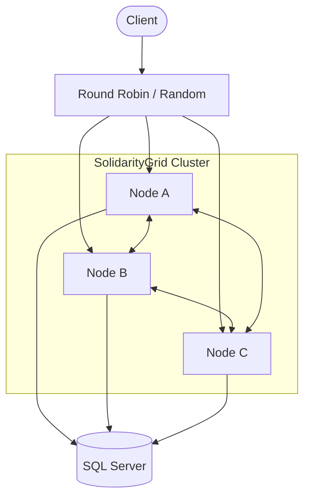
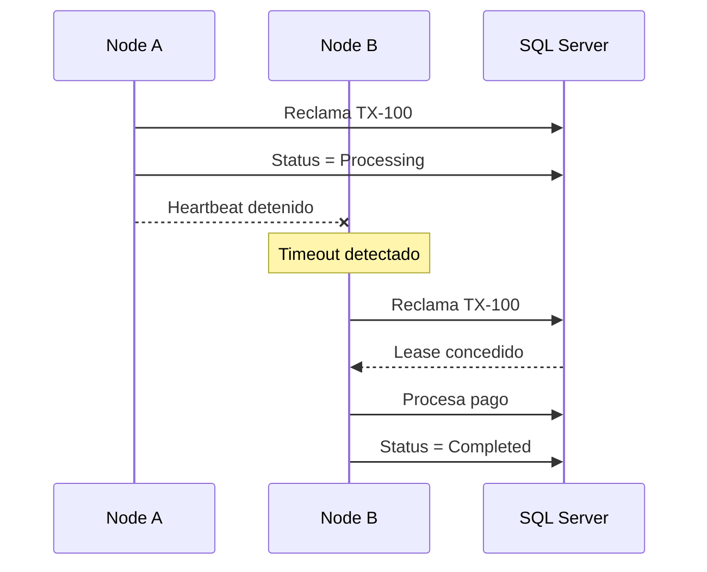
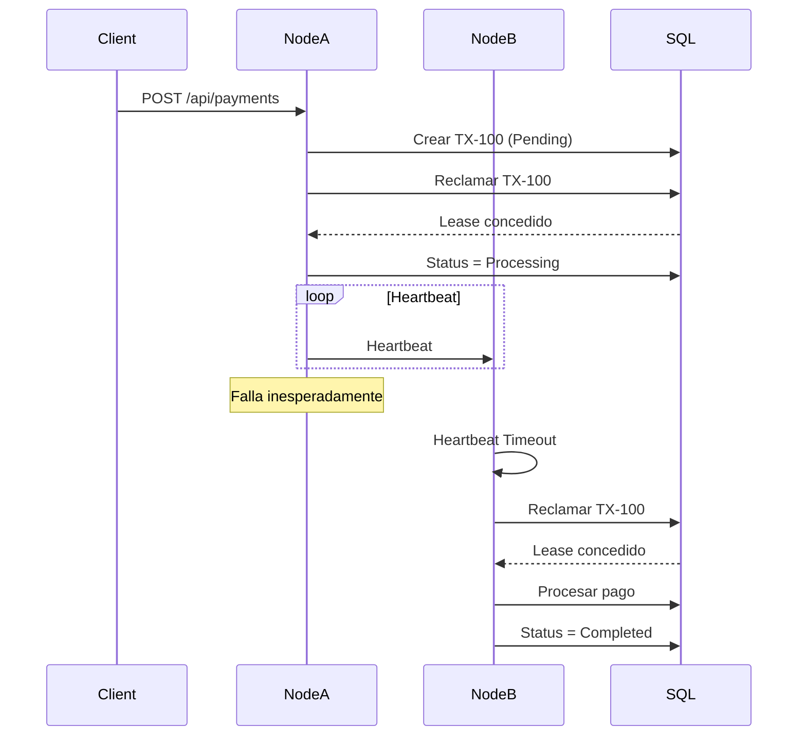

# SolidarityGrid

[](https://dotnet.microsoft.com/download/dotnet/8.0)
[](https://www.docker.com/)
[](https://www.microsoft.com/sql-server)
[]()

# Distributed Payment Processing Platform

SolidarityGrid es una prueba de concepto desarrollada en .NET 8 que implementa una plataforma distribuida para el procesamiento de pagos sin depender de un coordinador central ni de un sistema de mensajería externo.

La solución responde al desafío propuesto en la prueba técnica Payment Mesh Resilience, cuyo objetivo es demostrar cómo un conjunto de nodos puede colaborar para procesar transacciones de manera resiliente, detectar la caída de un compañero y recuperar automáticamente el trabajo pendiente, garantizando que cada pago sea procesado una única vez.

Para cumplir con este objetivo se implementó una arquitectura basada en Clean Architecture, procesamiento asíncrono mediante Background Services, coordinación entre nodos utilizando Heartbeats HTTP, y control de concurrencia mediante Optimistic Concurrency sobre SQL Server.

El resultado es una plataforma capaz de escalar horizontalmente, tolerar fallos y mantener la consistencia de los datos utilizando únicamente tecnologías incluidas en el ecosistema de .NET.

---

# Tabla de Contenidos

- Objetivos
- Características principales
- Arquitectura
- Flujo de procesamiento
- Decisiones de diseño
- Estrategia de resiliencia
- Estructura del proyecto
- Tecnologías
- Configuración
- Ejecución
- API
- Simulación de Failover
- Observabilidad
- Evidencias
- Mejoras futuras
- [Local Pipeline](#local-pipeline)

---

# Objetivos

La solución fue diseñada para demostrar los siguientes aspectos técnicos:

- Procesamiento distribuido de transacciones.
- Coordinación entre múltiples nodos sin un líder permanente.
- Recuperación automática de transacciones cuando un nodo deja de responder.
- Prevención del procesamiento duplicado mediante concurrencia optimista.
- Comunicación directa entre nodos utilizando HTTP.
- Despliegue completo con un único comando mediante Docker Compose.
- Arquitectura mantenible, desacoplada y preparada para evolucionar.

---

# Características principales

- Arquitectura basada en Clean Architecture.
- Procesamiento asíncrono mediante Background Services.
- Comunicación Peer-to-Peer utilizando Heartbeats HTTP.
- Detección automática de nodos inactivos.
- Recuperación de transacciones huérfanas (Failover).
- Optimistic Concurrency utilizando `RowVersion`.
- Asignación exclusiva de transacciones mediante Lease Ownership.
- Persistencia centralizada en SQL Server.
- Documentación automática mediante Swagger.
- Despliegue reproducible utilizando Docker Compose.

---

# Arquitectura

La plataforma está compuesta por tres nodos idénticos que ejecutan exactamente la misma aplicación.

No existe un nodo maestro ni un coordinador central. Cada instancia puede aceptar solicitudes, reclamar transacciones pendientes, procesar pagos y asumir el trabajo de otro nodo cuando detecta un fallo.

Todos los nodos comparten la misma base de datos y mantienen comunicación periódica mediante Heartbeats para conocer el estado del clúster.



## Responsabilidades de cada nodo

Cada instancia de la aplicación es capaz de:

- Exponer la API REST.
- Registrar nuevas transacciones.
- Reclamar pagos pendientes.
- Procesar transacciones de forma asíncrona.
- Publicar Heartbeats periódicos.
- Detectar nodos inactivos.
- Recuperar transacciones abandonadas.
- Finalizar el procesamiento de forma segura.

Esta estrategia elimina el punto único de fallo y permite escalar horizontalmente agregando nuevas instancias sin modificar la lógica de negocio.

---

# Flujo de procesamiento

El procesamiento de un pago se realiza de forma completamente asíncrona.

Cuando un cliente registra una nueva transacción, la API responde inmediatamente después de persistir la solicitud. El procesamiento real ocurre posteriormente mediante un servicio hospedado (`BackgroundService`), evitando bloquear las solicitudes HTTP mientras se simula el tiempo de procesamiento.

```text
                    +------------------+
                    |      Client      |
                    +------------------+
                              |
                              | POST /api/payments
                              ▼
                    +------------------+
                    |      API Node    |
                    +------------------+
                              |
                              ▼
                Payment almacenado como Pending
                              |
                              ▼
                 Background Payment Processor
                              |
                              ▼
                 Intenta reclamar la transacción
                              |
                              ▼
                 ¿Otro nodo ya la reclamó?
                     │                 │
                    Sí                No
                     │                 │
                     ▼                 ▼
                Finaliza       Cambia estado a
                               Processing
                                      │
                                      ▼
                           Actualiza Heartbeat
                                      │
                                      ▼
                          Simula procesamiento
                                      │
                                      ▼
                         Cambia estado a Completed
```

Durante este flujo únicamente un nodo puede reclamar una transacción determinada. Si el nodo responsable deja de responder antes de finalizar el procesamiento, otro nodo detectará la ausencia de Heartbeats y reclamará automáticamente la transacción para completar el trabajo.

Esta estrategia garantiza que cada pago alcance el estado Completed una sola vez, incluso ante fallos inesperados de cualquier instancia del clúster.

---
# Decisiones de diseño

Las decisiones arquitectónicas implementadas en SolidarityGrid buscan mantener un equilibrio entre simplicidad, mantenibilidad y resiliencia. La solución evita componentes externos de coordinación y concentra toda la lógica distribuida dentro de la propia aplicación, cumpliendo con los requisitos de la prueba técnica.

---

## Clean Architecture

La solución está organizada siguiendo los principios de Clean Architecture, separando claramente las responsabilidades entre las diferentes capas de la aplicación.

Esta organización permite que las reglas de negocio permanezcan independientes de la infraestructura, facilitando la mantenibilidad, la evolución del sistema y las pruebas unitarias.

```text
Presentation (API)
        │
        ▼
Application
        │
        ▼
Domain
        ▲
        │
Infrastructure
```

Cada proyecto posee una responsabilidad específica:

| Proyecto | Responsabilidad |
|----------|-----------------|
| SolidarityGrid.Api | Expone los endpoints REST, configuración, inyección de dependencias y documentación Swagger. |
| SolidarityGrid.Application | Contiene los casos de uso, servicios de aplicación y contratos utilizados por la solución. |
| SolidarityGrid.Domain | Define el modelo de dominio, entidades, enumeraciones, excepciones y reglas de negocio. |
| SolidarityGrid.Infrastructure | Implementa persistencia, Entity Framework Core, repositorios, Background Services y comunicación entre nodos. |

---

## Procesamiento asíncrono

El procesamiento de un pago no ocurre durante la solicitud HTTP.

Cuando un cliente registra una transacción, la API únicamente valida la información y persiste el registro con estado Pending, devolviendo inmediatamente una respuesta al consumidor.

El trabajo pesado es ejecutado posteriormente por un `BackgroundService`, permitiendo que la API permanezca ligera y con baja latencia.

### Beneficios

- Respuestas rápidas para el cliente.
- Menor tiempo de bloqueo de conexiones HTTP.
- Mayor capacidad para atender múltiples solicitudes concurrentes.
- Separación entre aceptación de solicitudes y procesamiento.

---

## Comunicación entre nodos

Los nodos forman una red Peer-to-Peer (P2P).

No existe un coordinador central responsable de distribuir el trabajo.

Cada instancia conoce la dirección de los demás nodos mediante configuración y mantiene comunicación periódica utilizando solicitudes HTTP.

```text
Node A  ←────→  Node B
   ▲               ▲
   │               │
   └──────→────────┘
         Node C
```

Esta estrategia elimina el punto único de fallo y permite incorporar nuevas instancias sin modificar la lógica de coordinación.

---

## Heartbeat

Cada nodo publica periódicamente un Heartbeat, indicando que continúa activo mientras procesa transacciones.

El Heartbeat representa un mecanismo liviano de supervisión entre nodos y constituye la base para detectar fallos dentro del clúster.

Si un nodo deja de actualizar su Heartbeat durante un tiempo superior al configurado, el resto del clúster lo considera inactivo.

```text
Node A

Heartbeat
Heartbeat
Heartbeat
Heartbeat
...
X

Timeout

↓

Node B detecta la ausencia de Heartbeats

↓

Node B inicia el proceso de recuperación
```

### Objetivos

- Detectar nodos caídos.
- Identificar transacciones abandonadas.
- Iniciar automáticamente el proceso de recuperación.
- Evitar intervención manual.

---

## Lease Ownership

Para evitar que varios nodos procesen simultáneamente la misma transacción, cada pago posee un propietario temporal (Lease Owner).

Cuando un nodo reclama una transacción pendiente, registra su identidad como propietario del procesamiento.

Mientras dicho Lease permanezca vigente, ningún otro nodo podrá continuar ese trabajo.

```text
TX-100

Owner = node-b

Status = Processing
```

Si el propietario deja de responder y su Heartbeat expira, otro nodo puede reclamar nuevamente esa transacción y convertirse en el nuevo propietario.

Esta estrategia evita condiciones de carrera sin necesidad de utilizar mecanismos de bloqueo distribuidos externos.

---

## Optimistic Concurrency

La consistencia de los datos se garantiza mediante Optimistic Concurrency utilizando una columna `RowVersion` administrada por SQL Server.

Cada actualización verifica que ningún otro proceso haya modificado previamente el mismo registro.

Si dos nodos intentan actualizar simultáneamente una transacción, únicamente uno podrá completar la operación; el segundo recibirá una excepción de concurrencia y descartará el procesamiento.

### Beneficios

- Evita bloqueos prolongados en la base de datos.
- Reduce la contención entre procesos concurrentes.
- Garantiza consistencia incluso bajo alta concurrencia.
- Aprovecha las capacidades nativas de SQL Server.

---

## Idempotencia

Uno de los requisitos principales del desafío consiste en garantizar que un pago nunca sea procesado más de una vez.

La solución implementa idempotencia mediante la combinación de:

- Estado de la transacción.
- Lease Ownership.
- Optimistic Concurrency.
- Validaciones antes de iniciar el procesamiento.

Una transacción marcada como Completed nunca volverá a ser reclamada, incluso si otro nodo intenta procesarla posteriormente.

---

# Estrategia de resiliencia

La recuperación automática constituye el núcleo de la solución.

Cuando un nodo deja de responder durante el procesamiento de un pago, el resto del clúster continúa supervisando su estado mediante Heartbeats.

Si el tiempo de espera configurado expira, cualquier nodo disponible puede reclamar las transacciones que quedaron en estado Processing, reasignando el trabajo y completándolo sin intervención humana.



Este mecanismo permite que la plataforma continúe operando incluso cuando uno o varios nodos dejan de estar disponibles.

---
## Secuencia de recuperación ante fallos

El siguiente diagrama muestra cómo el clúster recupera automáticamente una transacción cuando el nodo responsable deja de responder durante el procesamiento.



Este flujo demuestra cómo el sistema mantiene la continuidad del procesamiento sin depender de un coordinador central. La detección del fallo se realiza mediante Heartbeats periódicos y la recuperación se apoya en el mecanismo de Lease Ownership junto con Optimistic Concurrency, garantizando que la transacción se complete una única vez.
___

# Estrategia de consenso

SolidarityGrid no implementa un algoritmo formal de consenso distribuido como Raft o Paxos.

En su lugar, utiliza una estrategia de coordinación liviana basada en:

- Base de datos compartida.
- Heartbeats periódicos.
- Lease Ownership.
- Optimistic Concurrency.

Esta aproximación resulta suficiente para el alcance de la prueba técnica, manteniendo una implementación simple, fácilmente entendible y alineada con el requisito de no utilizar servicios externos de mensajería o coordinación.

---

# Estructura del proyecto

```text
src
│
├── SolidarityGrid.Api
│
├── SolidarityGrid.Application
│
├── SolidarityGrid.Domain
│
└── SolidarityGrid.Infrastructure
```

## SolidarityGrid.Domain

Contiene el núcleo del dominio.

- Entidades
- Enumeraciones
- Value Objects
- Interfaces
- Reglas de negocio
- Excepciones

---

## SolidarityGrid.Application

Implementa los casos de uso de la aplicación.

- Commands
- Queries
- DTOs
- Validaciones
- Servicios de aplicación
- Contratos

---

## SolidarityGrid.Infrastructure

Implementa todos los detalles técnicos.

- Entity Framework Core
- SQL Server
- Repositorios
- Background Services
- Heartbeat Service
- Payment Processing Service
- Comunicación HTTP entre nodos

---

## SolidarityGrid.Api

Punto de entrada de la aplicación.

Responsabilidades principales:

- Configuración de servicios.
- Middleware.
- Endpoints REST.
- Swagger.
- Health endpoints.
- Inyección de dependencias.

___
# Tecnologías

La solución fue desarrollada utilizando tecnologías del ecosistema .NET, priorizando simplicidad, mantenibilidad y facilidad de despliegue.

| Tecnología | Versión | Propósito |
|------------|---------|-----------|
| .NET | 8 | Plataforma principal |
| ASP.NET Core | 8 | API REST |
| Entity Framework Core | 8 | Persistencia |
| SQL Server | 2022 | Base de datos compartida |
| Docker | 27+ | Contenedorización |
| Docker Compose | v2 | Orquestación local |
| Swagger / OpenAPI | 3.0 | Documentación de la API |

---

# Configuración

Cada instancia de la aplicación posee una configuración independiente que define su identidad dentro del clúster y los parámetros utilizados para coordinar el procesamiento distribuido.

## Configuración del nodo

```json
{
  "Node": {
    "NodeName": "node-a",
    "HeartbeatTimeoutSeconds": 10,
    "ProcessingIntervalSeconds": 5,
    "PeerNodes": [
      "http://node-b:8080",
      "http://node-c:8080"
    ]
  }
}
```

## Parámetros

| Propiedad | Descripción |
|------------|-------------|
| NodeName | Identificador único del nodo dentro del clúster. |
| HeartbeatTimeoutSeconds | Tiempo máximo permitido sin recibir Heartbeats antes de considerar un nodo inactivo. |
| ProcessingIntervalSeconds | Intervalo utilizado por el Background Service para buscar nuevas transacciones pendientes. |
| PeerNodes | Lista de nodos con los que se mantiene comunicación para verificar el estado del clúster. |

---

# Puesta en marcha

## Requisitos

Antes de ejecutar la solución es necesario contar con:

- .NET SDK 8
- Docker Desktop
- Docker Compose

---

## Clonar el repositorio

```bash
git clone https://github.com/<usuario>/SolidarityGrid.git

cd SolidarityGrid
```

---

## Levantar toda la plataforma

La solución completa se inicia mediante un único comando.

```bash
docker compose up --build
```

Este comando crea automáticamente:

- Base de datos SQL Server.
- Red interna de Docker.
- Nodo A.
- Nodo B.
- Nodo C.

No se requiere ninguna configuración manual adicional.

---

## Contenedores

Una vez iniciado el entorno deberán encontrarse los siguientes servicios:

| Contenedor | Función |
|------------|----------|
| solidaritygrid-node-a | Nodo de procesamiento |
| solidaritygrid-node-b | Nodo de procesamiento |
| solidaritygrid-node-c | Nodo de procesamiento |
| solidaritygrid-sql | SQL Server |

Puede verificarse utilizando:

```bash
docker ps
```

---

# Acceso a Swagger

Cada nodo expone su propia documentación OpenAPI.

| Nodo | URL |
|-------|-----|
| Node A | http://localhost:8081/swagger |
| Node B | http://localhost:8082/swagger |
| Node C | http://localhost:8083/swagger |

Aunque cualquiera de los tres puede recibir solicitudes, durante las pruebas es suficiente utilizar uno de ellos.

---

# API

## Crear un pago

Registra una nueva solicitud de procesamiento.

### Endpoint

```http
POST /api/payments
```

### Request

```json
{
  "transactionId": "TX001",
  "amount": 150.00,
  "currency": "USD"
}
```

### Respuesta

```http
202 Accepted
```

La API responde inmediatamente después de registrar la transacción.

El procesamiento continúa de forma asíncrona mediante un `BackgroundService`.

---

## Consultar pagos

Obtiene el listado de transacciones registradas y su estado actual.

### Endpoint

```http
GET /api/payments
```

### Información disponible

- Identificador de la transacción.
- Estado.
- Nodo responsable.
- Fecha de creación.
- Fecha de inicio del procesamiento.
- Fecha de finalización.

### Ejemplo

| Transaction | Status | Owner |
|--------------|------------|-----------|
| TX001 | Completed | node-a |
| TX002 | Processing | node-c |
| TX003 | Pending | - |

---

## Estado del clúster

Permite conocer qué nodos se encuentran disponibles.

### Endpoint

```http
GET /api/nodes/status
```

### Respuesta

```json
{
  "aliveNodes": [
    "node-a",
    "node-b",
    "node-c"
  ],
  "deadNodes": [],
  "totalNodes": 3
}
```

Este endpoint facilita verificar el comportamiento del mecanismo de Heartbeats durante las pruebas de resiliencia.

---

# Cómo ejecutar la demostración

La siguiente secuencia permite validar el funcionamiento completo del sistema.

## 1. Iniciar la plataforma

```bash
docker compose up --build
```

Esperar hasta que los cuatro contenedores se encuentren disponibles.

---

## 2. Abrir Swagger

Acceder a cualquiera de los nodos.

Ejemplo:

```
http://localhost:8081/swagger
```

---

## 3. Registrar múltiples pagos

Crear varias solicitudes utilizando el endpoint:

```http
POST /api/payments
```

Puede enviarse una cantidad suficiente de solicitudes para observar el comportamiento concurrente del clúster.

---

## 4. Consultar el estado de las transacciones

Invocar:

```http
GET /api/payments
```

Debería observarse una distribución similar a la siguiente:

| Transaction | Nodo |
|--------------|---------|
| TX001 | node-a |
| TX002 | node-c |
| TX003 | node-b |
| TX004 | node-a |
| TX005 | node-c |

Cada transacción es procesada por un único nodo.

No existen pagos duplicados.

---

## 5. Verificar el estado del clúster

Consultar:

```http
GET /api/nodes/status
```

El resultado debe mostrar todos los nodos disponibles mientras permanezcan activos.

---
# Simulación de Failover

Uno de los principales objetivos de la solución es demostrar la capacidad del clúster para recuperarse automáticamente cuando un nodo deja de responder durante el procesamiento de una transacción.

La siguiente secuencia permite reproducir el escenario planteado en la prueba técnica.

---

## 1. Iniciar la plataforma

```bash
docker compose up --build
```

Esperar hasta que todos los contenedores se encuentren en ejecución.

---

## 2. Registrar múltiples pagos

Utilizar el endpoint:

```http
POST /api/payments
```

Durante el procesamiento, las transacciones pasarán por los estados:

```text
Pending

↓

Processing

↓

Completed
```

---

## 3. Detener un nodo

Mientras una transacción se encuentra en estado Processing, detener uno de los contenedores.

Ejemplo:

```bash
docker stop solidaritygrid-node-a
```

---

## 4. Esperar el Timeout

Los demás nodos continuarán enviando y verificando Heartbeats.

Al superar el tiempo configurado en `HeartbeatTimeoutSeconds`, el nodo detenido será considerado inactivo.

---

## 5. Recuperación automática

Uno de los nodos disponibles reclamará las transacciones que quedaron pendientes y continuará el procesamiento hasta completarlas.

No se requiere intervención manual.

---

## Resultado esperado

Después de consultar nuevamente:

```http
GET /api/payments
```

Las transacciones originalmente asignadas al nodo detenido deberán aparecer con estado:

```text
Completed
```

y con un nuevo nodo responsable.

Este comportamiento demuestra la capacidad de recuperación automática del clúster frente a fallos inesperados.

---

# Observabilidad

Uno de los criterios de evaluación de la prueba consiste en que los registros permitan comprender claramente el comportamiento del sistema distribuido.

Por este motivo, cada nodo registra los eventos más relevantes del ciclo de vida de una transacción.

## Eventos registrados

- Inicio del procesamiento.
- Reclamo de una transacción.
- Actualización del Heartbeat.
- Detección de nodos inactivos.
- Recuperación de transacciones.
- Finalización del procesamiento.
- Errores de concurrencia.
- Cambios de estado.

## Ejemplo de ejecución normal

```text
[node-a] Payment TX-100 registered.

[node-a] Transaction TX-100 claimed.

[node-a] Processing transaction TX-100.

[node-a] Transaction TX-100 completed successfully.
```

## Ejemplo de recuperación

```text
[node-a] Processing transaction TX-200...

[node-b] Heartbeat timeout detected for node-a.

[node-b] Reclaiming transaction TX-200.

[node-b] Transaction TX-200 completed successfully.
```

Estos registros permiten reconstruir el flujo completo de una transacción y facilitan el análisis del comportamiento del sistema durante escenarios de alta concurrencia o fallos.

---

# Evidencias

Para facilitar la validación de la solución se recomienda incluir las siguientes capturas de pantalla en el repositorio.

- Plataforma iniciada mediante Docker Compose.
- Contenedores activos (`docker ps`).
- Swagger disponible en los tres nodos.
- Lista de pagos procesados.
- Estado del clúster.
- Base de datos mostrando el estado de las transacciones.
- Logs donde se observe la recuperación automática de un nodo.

---

# Mejoras futuras

La solución implementa una arquitectura ligera enfocada en cumplir los requisitos de la prueba técnica. No obstante, existen diversas oportunidades de evolución para escenarios de producción.

## Observabilidad

- OpenTelemetry.
- Prometheus.
- Grafana.
- Trazabilidad distribuida.
- Métricas por nodo.

## Resiliencia

- Retry Policies mediante Polly.
- Circuit Breaker.
- Exponential Backoff.
- Health Checks avanzados.

## Escalabilidad

- RabbitMQ o Azure Service Bus para desacoplar el procesamiento.
- Kubernetes para escalado automático.
- Descubrimiento dinámico de nodos.
- Balanceadores de carga externos.

## Calidad

- Pruebas unitarias.
- Pruebas de integración.
- Pruebas de resiliencia automatizadas.
- Pruebas de carga.
- Análisis estático de código.

---

# Conclusiones

SolidarityGrid demuestra cómo es posible construir una plataforma distribuida resiliente utilizando únicamente herramientas del ecosistema .NET y SQL Server, sin depender de servicios externos de mensajería o coordinación.

La solución implementa una estrategia basada en Heartbeats, procesamiento asíncrono, Lease Ownership y Optimistic Concurrency para coordinar múltiples nodos, detectar fallos y recuperar automáticamente transacciones abandonadas.

El resultado es una arquitectura simple, desacoplada y fácilmente extensible que satisface los objetivos planteados por la prueba técnica, garantizando consistencia, tolerancia a fallos y procesamiento idempotente.

---

# Architecture Decision Records (ADR)

Durante el desarrollo de la solución se tomaron las siguientes decisiones de arquitectura.

| Decisión | Justificación |
|----------|---------------|
| Clean Architecture | Separa las reglas de negocio de la infraestructura, facilitando mantenibilidad, pruebas y evolución del sistema. |
| SQL Server compartido | Centraliza el estado de las transacciones y simplifica la coordinación distribuida dentro del alcance de la prueba técnica. |
| BackgroundService | Desacopla la recepción de solicitudes HTTP del procesamiento de pagos, evitando bloquear las peticiones del cliente. |
| Heartbeats HTTP | Permiten detectar nodos inactivos sin incorporar herramientas externas de monitoreo o coordinación. |
| Lease Ownership | Garantiza que únicamente un nodo sea responsable del procesamiento de una transacción en un momento determinado. |
| Optimistic Concurrency (RowVersion) | Evita el procesamiento duplicado utilizando el control de concurrencia nativo de SQL Server. |
| Docker Compose | Permite levantar toda la plataforma con un único comando, cumpliendo uno de los requisitos principales de la prueba técnica. |
| Comunicación HTTP entre nodos | Reduce la complejidad de la solución y elimina la dependencia de brokers o middleware externos. |

Estas decisiones priorizan una solución simple, mantenible y alineada con los objetivos del desafío, evitando introducir componentes que incrementen la complejidad sin aportar un beneficio significativo para el alcance de la prueba.

__

# Autor

David Estiven Vélez González

Full Stack .NET Developer

Tecnologías principales:

- C#
- .NET 8
- ASP.NET Core
- Entity Framework Core
- SQL Server
- Docker
- Clean Architecture
- APIs REST
- Sistemas Distribuidos

___

# Local Pipeline

```powershell
Write-Host "1. Levantando la red Mesh de SolidarityGrid..." -ForegroundColor Cyan
docker compose up -d --build

Write-Host "2. Esperando el inicio de los contenedores y SQL Server..." -ForegroundColor Yellow
Start-Sleep -Seconds 15

Write-Host "3. Simulando inyección de pagos concurrentes (Stress Test)..." -ForegroundColor Cyan
1..5 | ForEach-Object {
     $body = @{
         transactionId = "TX$($_)"
         amount = $_ * 15
         currency = "ARC"
     } | ConvertTo-Json

     Invoke-RestMethod `
         -Method POST `
         -Uri "http://localhost:8081/api/Payments" `
         -ContentType "application/json" `
         -Body $body
}

Write-Host "4. [CAOS] Derribando bruscamente el Nodo A..." -ForegroundColor Red
docker stop solidaritygrid-node-a

Write-Host "5. Monitoreando logs del clúster de relevo (Nodo B y C)..." -ForegroundColor Green
docker compose logs -f node-b node-c